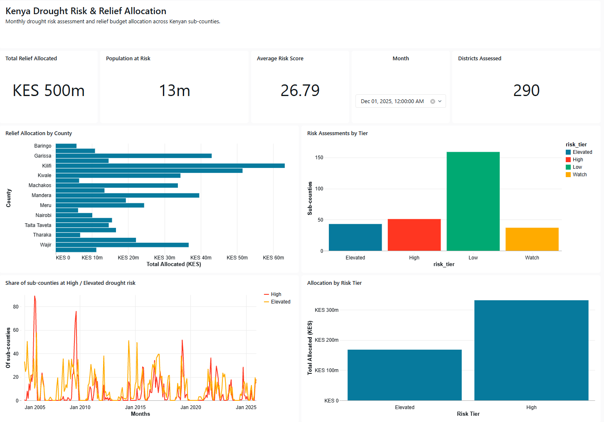
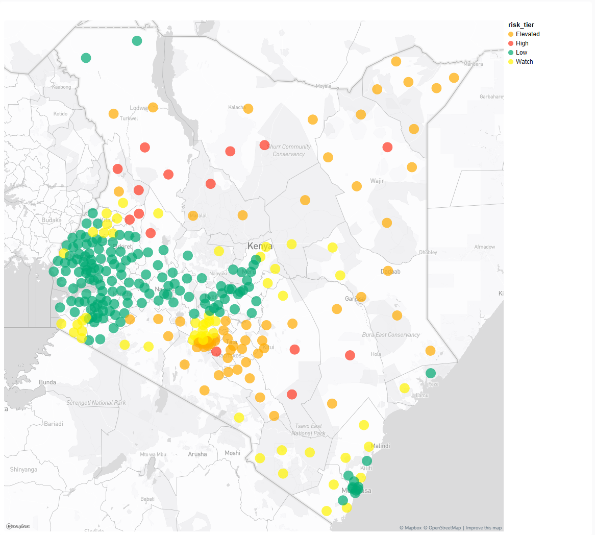
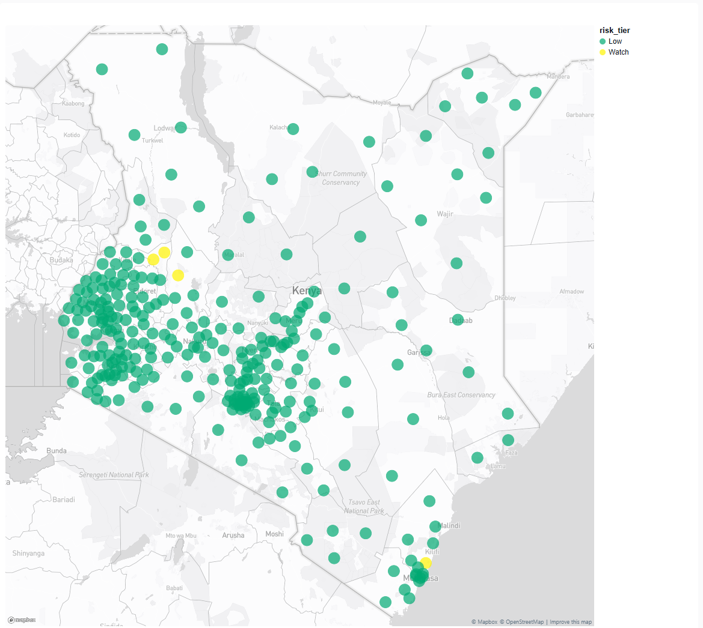
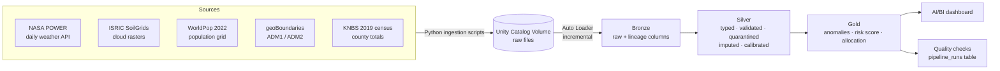
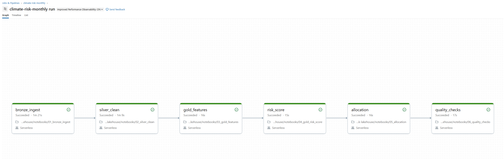
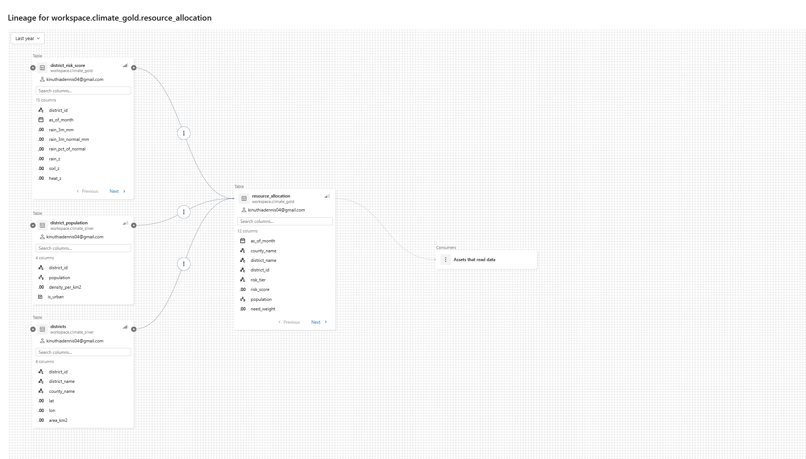

# Climate Resilience & Resource Allocation Platform


**Problem:** Field offices across 290 sub-counties in Kenya's 47 counties need to decide where drought-relief and agricultural-support resources go first. Rainfall, temperature and soil data exist but are scattered across raw files and APIs, so prioritisation is slow and hard to justify.

**Solution:** A Databricks lakehouse that ingests 41 years of daily climate data plus soil and population data, cleans and validates it through a Bronze → Silver → Gold pipeline, and produces a monthly, explainable drought-risk score and budget allocation for every sub-county. It runs as a scheduled, monitored job, with automated tests on every push.

**Stack:** Databricks · PySpark · SQL · Delta Lake · Unity Catalog · Auto Loader · Lakeflow Jobs · AI/BI Dashboards · GitHub Actions · pytest



---

## Results

The score was calibrated on the 2022 drought and **validated on seasons it never saw**:

| Season (Oct–Dec) | Sub-counties at Watch or above | Context |
|---|---|---|
| 2010 | 160 of 290 (55%) | Failed rains preceding the 2011 Horn of Africa drought |
| 2016 | 249 of 290 (86%) | Failed rains; national drought disaster declared early 2017 |
| 2019 | 4 of 290 (1%) | One of the wettest seasons on record |
| 2022 | 139 of 290 (48%) | Fifth consecutive failed season |

Without any location input, the highest-scoring counties in December 2022 were Marsabit, Samburu, Tana River, Wajir and Mandera, which are Kenya's arid and semi-arid counties most affected by that drought.

| December 2022 (drought) | December 2019 (wet year) |
|---|---|
|  |  |

**Pipeline at a glance**

| Metric | Value |
|---|---|
| Sub-counties / counties | 290 / 47 |
| Daily weather records (1985–2025) | 4,342,750 |
| Rows quarantined by validation | 10 (0.00023%) |
| End-to-end job runtime (serverless) | 3 min 40 s |
| Rows read / written per run | 17.9M / 4.8M |
| Budget reconciliation | Allocations sum to the KES 500M budget within 2 KES |
| Automated tests | 6, run on every push |

---

## Architecture



The whole flow runs as a six-task Lakeflow Job, scheduled monthly, with failure alerts:



Unity Catalog tracks lineage from raw Bronze tables through to the allocation:



---

## How the risk score works

Each sub-county's recent conditions are compared with **its own 1991–2020 normal for the same time of year**, so a dry month in a normally arid area isn't flagged, but the same rainfall in a normally wet area is.

1. **3-month rolling window** of rainfall, root-zone soil wetness and average maximum temperature, because crops respond to a season, not a single month.
2. **Anomaly (z-score)** against the baseline for the same calendar month.
3. **Severity on a fixed scale** (0 = normal or better, 1 = extreme, at 2 standard deviations). Fixed thresholds let the score say "nobody is at risk this month" or "half the country is". An earlier version used percentile ranks, which always labelled about a quarter of districts High, even in the wettest year on record.
4. **Weighted composite, 0–100:**

   | Component | Weight | Why |
   |---|---|---|
   | Rainfall deficit | 40% | The primary drought driver |
   | Soil dryness | 25% | Shows whether the deficit has reached crops |
   | Heat | 20% | Accelerates evaporation and crop stress |
   | Low soil organic carbon | 15% | Soil that holds less water is more vulnerable (a fixed land characteristic) |

5. **Tiers:** High ≥ 55 · Elevated ≥ 40 · Watch ≥ 25 · Low < 25. Weights and thresholds live in [`config/risk_weights.yml`](config/risk_weights.yml).

**Allocation:** eligible sub-counties (High or Elevated, and not urban) share the budget in proportion to *risk score × population*. The share is computed in SQL, and a quality check confirms the allocations reconcile with the total budget.

---

## Data quality and engineering decisions

Several problems in the source data were found and fixed along the way. Each one is documented because each one would otherwise have silently distorted the results.

- **Population overcount in north-eastern Kenya.** WorldPop's unconstrained estimates placed about 2.6M people in Mandera; the 2019 census counted 867,457 (Wajir and Garissa were also inflated about 2×, while Kiambu was undercounted). Since these counties also score high on drought risk, the allocation would have sent them a heavily inflated share. **Fix:** sub-county populations are calibrated to official KNBS 2019 county totals, using WorldPop only for the distribution *within* each county. The census file is locked by a test that checks all 47 counties sum to the national total of 47,564,296.
- **Weather resolution.** NASA POWER data sits on a coarse grid (~50 km). The 290 sub-counties fall into only 93 distinct grid cells, and up to 19 dense sub-counties share one cell around Nairobi. Resolution is much better in the arid north and east, where sub-counties are large and drought risk is highest.
- **Soil gaps.** SoilGrids has no data for built-up areas. 18 sub-counties (urban cores of Nairobi, Mombasa, Kisumu and Nakuru, plus lakeshore Nyatike) get their county median, falling back to the national median, and are flagged `soil_imputed = true`. Soil layers are averaged with depth weighting (0–5, 5–15 and 15–30 cm are 5, 10 and 15 cm thick).
- **Validation with quarantine, not deletion.** Every weather row is checked against six rules (known district, valid date, rainfall 0–500 mm, temperature −10 to 55 °C, max ≥ min temperature, soil wetness 0–1). Failing rows go to a quarantine table listing *every* rule they broke; nothing disappears silently. NASA's `-999` missing-value marker is converted to real nulls first.
- **Urban exclusion.** Drought relief for farming doesn't apply to city centres. Sub-counties with density ≥ 2,000 people/km² are flagged urban, plus a city-county override for Nairobi and Mombasa, because a national park pulls Lang'ata's average density below the threshold.
- **Idempotent, incremental loads.** Auto Loader ingests only new files; Silver and Gold are rebuilt deterministically, so re-running the job gives the same result.
- **Observability.** Every run appends its quality-check results (row counts, quarantine share, freshness, score validity, budget reconciliation) to a `pipeline_runs` table, and the job fails loudly if any check fails.

---

## Testing

| Layer | What's checked | Where |
|---|---|---|
| **Unit tests** (pytest + local Spark) | Missing-value handling, day-of-year → date (including leap years), every validation rule | [`tests/test_transforms.py`](tests/test_transforms.py) |
| **Config tests** | Weights sum to 1, tiers are ordered, census file covers 47 counties and reconciles to the national total | [`tests/test_config.py`](tests/test_config.py) |
| **Runtime data-quality checks** | Row counts, quarantine share, freshness, score validity, budget reconciliation | [`notebooks/06_quality_checks`](notebooks/) |

The Silver notebook imports its transformation logic from [`src/climate_risk/transforms.py`](src/climate_risk/transforms.py), so the tests exercise the exact code the pipeline runs. GitHub Actions runs the suite on every push.

---

## Project structure

```
climate-risk-lakehouse/
├── config/
│   ├── risk_weights.yml           # score weights, tier thresholds, urban density
│   └── census_2019_county.csv     # KNBS county totals (reference data)
├── dashboards/                    # AI/BI dashboard definition
├── docs/images/                   # screenshots used in this README
├── ingestion/                     # local download scripts (boundaries, weather, soil, population)
├── jobs/climate-risk-monthly.yml  # job definition as code
├── notebooks/
│   ├── 00_setup.sql               # schemas and landing volume
│   ├── 01_bronze_ingest           # Auto Loader → Bronze
│   ├── 02_silver_clean            # typing, validation, quarantine, imputation, calibration
│   ├── 03_gold_features           # monthly aggregates and anomalies
│   ├── 04_gold_risk_score         # composite score, tiers, backtest queries
│   ├── 05_allocation              # budget allocation
│   └── 06_quality_checks          # runtime checks → pipeline_runs
├── src/climate_risk/transforms.py # shared Silver logic (imported by notebook and tests)
├── tests/                         # pytest suite
└── .github/workflows/tests.yml    # CI
```

---

## How to run it

1. **Download the data locally** (Python 3.11):
   ```bash
   pip install -r requirements.txt
   python ingestion/download_boundaries.py
   python ingestion/make_districts.py
   python ingestion/fetch_weather.py      # ~1 hour, resumable
   python ingestion/fetch_soil.py
   python ingestion/fetch_population.py
   ```
2. **In Databricks** (Free Edition works): clone this repo as a Git folder, run `notebooks/00_setup.sql`, and upload the contents of `raw/` (plus `config/census_2019_county.csv` into a `census` folder) to the `landing` volume.
3. **Create the job** from [`jobs/climate-risk-monthly.yml`](jobs/climate-risk-monthly.yml), replacing `<your-email>` and `<alert-email>`, or run notebooks `01`–`06` in order.
4. **Run the tests locally:**
   ```bash
   pip install -r requirements-dev.txt
   python -m pytest -v
   ```

---

## Limitations and future work

- **Single-season window:** the 3-month window captures how bad one season was, not the buildup across several failed seasons. It rates December 2016 (one severe failure) above December 2022 (the fifth failure in a row, and the worse humanitarian crisis). *Next:* add a 12-month rainfall anomaly alongside the 3-month one.
- **Rainfall scoring:** plain z-scores understate droughts in arid areas, where rainfall varies widely year to year. Tier thresholds were calibrated on 2022 and validated on 2010 and 2016. *Next:* replace z-scores with a gamma-fitted Standardized Precipitation Index (SPI).
- **Weather resolution:** *next:* add CHIRPS rainfall (~5 km), which would give nearly every sub-county its own rainfall signal.
- **Single point per sub-county:** large northern sub-counties (up to ~40,000 km²) are represented by one point. *Next:* sample several points per sub-county.
- **Administrative units:** the 290 units are IEBC constituencies (labelled sub-counties in geoBoundaries), which differ from the KNBS census sub-counties; population is therefore calibrated at county level, where both agree.
- **Not an official drought declaration.** This is a prioritisation index for comparing areas and seasons, not a substitute for NDMA's early-warning phases.

---

## Data sources and licences

| Data | Source | Licence |
|---|---|---|
| Sub-county (ADM2) boundaries | geoBoundaries gbOpen, from IEBC and OCHA ROSEA | CC BY 3.0 IGO |
| County (ADM1) boundaries | geoBoundaries gbOpen | Public domain |
| Daily weather and root-zone soil wetness | NASA POWER (Prediction Of Worldwide Energy Resources) | Free to use with acknowledgement |
| Soil properties | ISRIC SoilGrids 2.0 | CC BY 4.0 |
| Population grid (2022, 1 km, UN-adjusted) | WorldPop, University of Southampton | CC BY 4.0 |
| County population totals | KNBS, *2019 Kenya Population and Housing Census, Volume I*, Table 2.2 | Extracts may be published with acknowledgement |

---

## Author

**Dennis Kinuthia**, data engineer. [LinkedIn](https://www.linkedin.com/in/dennis-kibunja/) · Open to remote data engineering roles.
